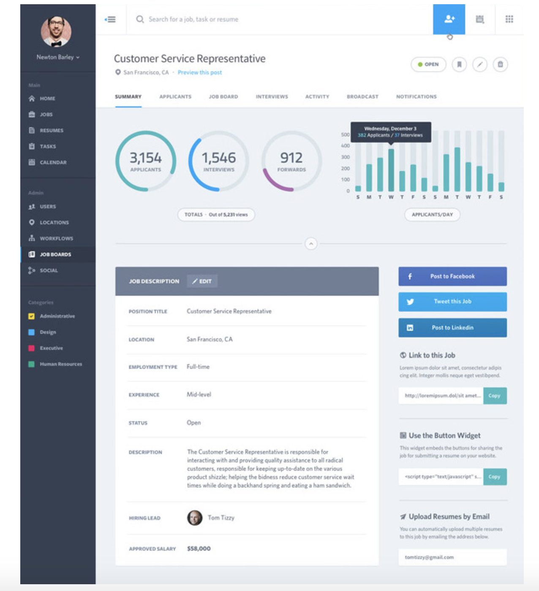
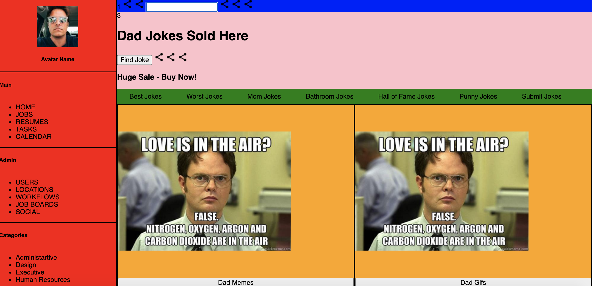
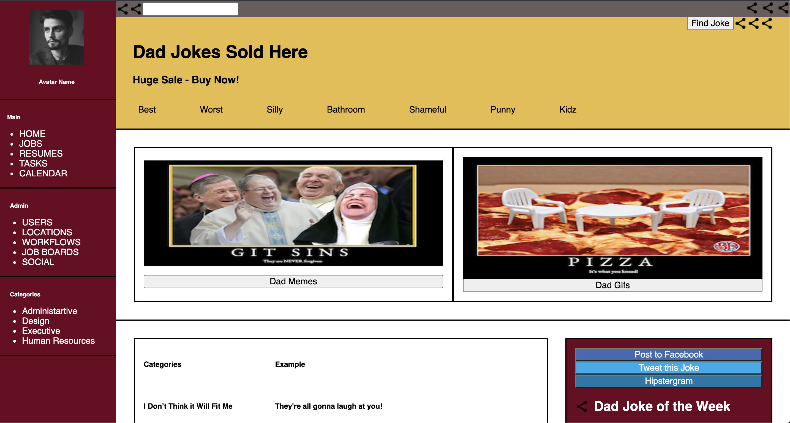

# Project: Static-Comp-2
## Contributor: Joe Varela
### Deployed Project: [Static Comp Challenge Round 2](https://jobbotrock.github.io/jv-static-comp-2/)

### Project Overview

 * This was my second static-comp challenge, where the goal was to recreate the original comp as seen below
 * Compared to my first static-comp, this static comp really challenged my flex, grid, HTML, and CSS skills
 * This project required placing a TON of elements on the page and I'm now realizing the importance of using a wireframe to setup my HTML
 * The project's goal was to create a responsive layout that can be accessed on various different screen sizes (i.e. mobile, tablet, desktop)
 
### Original Layout

### Learning Goals

 * **Technical:** Increase my experience in building responsive layouts using CSS flex and gridbox
 * **Professional:** Increase my experience preparing for a project using a wireframe
 * **Personal:** I would like to enter my project into the thunderdome to get grilled. My project isn't the best but it's better that whwat I could do last go around.

### Project Progression
 * This project really challenged me to plan my layout before starting my project. Unlike my first static-comp, I used a static-comp which really helped my understand the concepts of grid and flexbox.
 
### Wireframe

### Original Page Layout

 * I made sure to use clashing colors in order see the different borders. Classic 90s page layout was my goal here
 

### Original Color Scheme

## Future Iterations

I would like to make this more creative and add more personal touches. The responsiveness isn't the best right now, I will be meeting with my mentor in order to 
